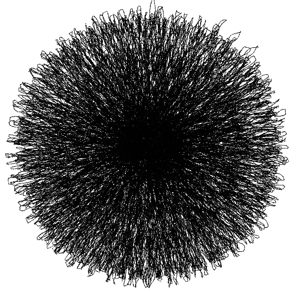
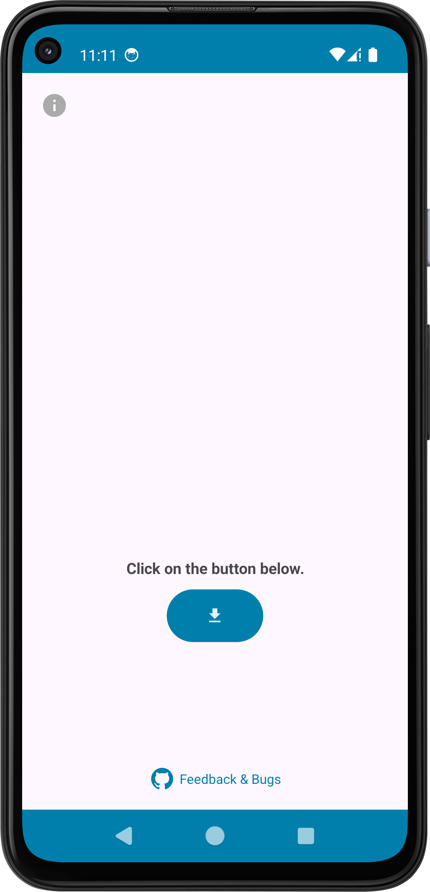
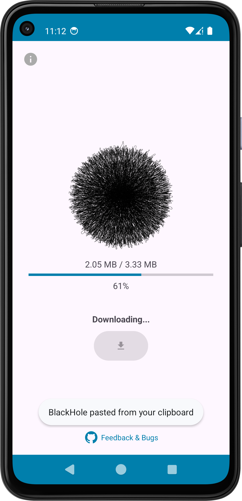
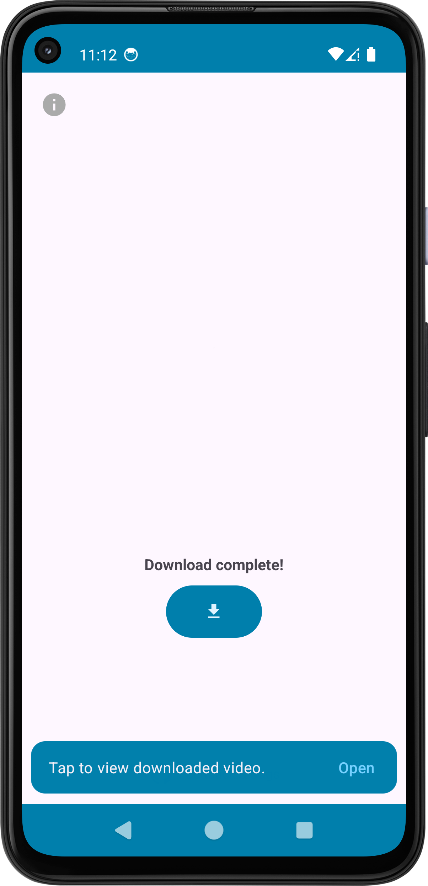

#  BlackHole

**BlackHole** is an Android app that lets you download videos from multiple platforms using the Cobalt Tools API hosted at [https://cobalt.meowing.de/](https://cobalt.meowing.de/). Supported platforms include YouTube, TikTok, Instagram, Facebook, Twitter (X), Snapchat, Reddit, Pinterest, Twitch, and more.

**How it works:**  
- From supported platforms, simply **share the video** and choose BlackHole to download.  
- Or **copy the video URL** and paste it into the app, then click **Download**.  

**Requirements:**  
- Android 12 or higher (uses Monet theme support).

---

**Screenshots:**  

  
  
  

---

**You can download the latest APK from the [Releases](../../releases) page.**

If you encounter any bugs or have ideas for new features, feel free to open an issue. The developer will try to fix bugs and consider feature requests.

This project is not affiliated with or endorsed by Cobalt Tools or any of the platforms listed above. The developer is not responsible for how this app or the API is used. Use at your own risk.

**License:** The APK is for personal use only. You may download and install it, and share links to this repository, but you may not redistribute, modify, or commercialize the app. See the [LICENSE](./LICENSE) file for details.

